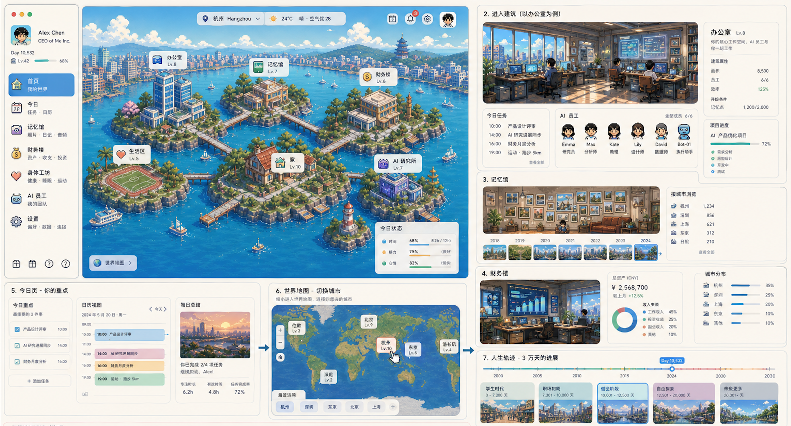

# Memory Map 产品文档



## 1. 产品定义

Memory Map 是一个基于真实地图的人生操作系统与 AI 公司控制台。

它不是相册、普通地图、旅行记录或复杂游戏，而是把用户的真实生活数据转化为一个可理解、可行走、可交互的数字世界。

一句话：

> 你一个人的 AI 公司，在地图上的数字世界。

## 2. 核心定位

Memory Map 的核心定位是：

> 基于真实生活数据，构建一个可以记录、理解、建议和成长的个人世界。

产品每天要回答一个问题：

> 我今天该干嘛？

产品不只帮助用户回顾过去，还要帮助用户理解当前状态，并做出下一步决策。

## 3. World Engine 总体架构

Memory Map 的底层架构分为四层：

1. Layer 0：真实地图，Geometry。
2. Layer 1：语义地图，Meaning。
3. Layer 2：世界生成，World Model & Rendering Rules。
4. Layer 3：游戏层，Personal Game Layer。

数据流规则：

> 数据只往上流：Layer 0 -> Layer 1 -> Layer 2 -> Layer 3。

交互流规则：

> 交互从上往下驱动：Layer 3 -> Layer 1 -> Layer 0。

这意味着：

- 真实地图负责提供硬事实：在哪里、什么时候、发生了什么轨迹。
- 语义地图负责理解人生：这个地点对用户意味着什么。
- 世界生成层负责把语义翻译成可渲染的世界规则。
- 游戏层负责表达和交互：让意义长成可走、可看、可操作、可解锁的个人世界。

Memory Map 的护城河不在地图，也不在画面，而在 Layer 1：

> 把生活数据变成世界形态的语义规则。

Layer 3 是用户感知最强的部分，但它不是固定关卡或统一地图。每个人的 Layer 3 都由自己的 Layer 1 生成和解锁。

## 4. Layer 0：真实地图

Layer 0 的职责是提供“在哪里”。

它处理真实世界中的硬事实，包括位置、路径、POI、行政区和环境数据。

### 4.1 Place

```ts
type Place = {
  id: string
  lat: number
  lng: number
  poi_type: "park" | "office" | "mall" | "home" | "school" | "restaurant" | "other"
  admin: {
    city?: string
    district?: string
  }
  env?: {
    humidity?: number
    temp?: number
    aqi?: number
    noise_estimate?: number
  }
}
```

### 4.2 Trace

```ts
type Trace = {
  timestamp: string
  lat: number
  lng: number
  speed?: number
  heading?: number
}
```

### 4.3 输入来源

- GPS 与移动轨迹。
- Mapbox POI。
- 照片与视频定位信息。
- 用户手动导入的图片、笔记和音频。
- 天气与环境 API。
- 后续可接入 AQI、湿度、温度、噪音估算等数据。

Layer 0 不判断意义，只提供事实。

## 5. Layer 1：语义地图

Layer 1 是 Memory Map 的核心。

它把“地点 + 行为 + 身体状态 + 环境”转化为“意义”。

### 5.1 Event：统一事件抽象

Event 是语义层的基本单位。

```ts
type Event = {
  id: string
  time_range: {
    start: string
    end?: string
  }
  place_id: string
  media?: {
    photos?: string[]
    audio?: string[]
    notes?: string[]
  }
  bio?: {
    hrv?: number
    rhr?: number
    steps?: number
    sleep_score?: number
    load?: number
  }
  env?: {
    humidity?: number
    temp?: number
    aqi?: number
  }
  tags: Array<"work" | "social" | "exercise" | "travel" | "finance" | "life">
  intensity?: number
  valence?: number
}
```

字段说明：

- `time_range`：事件发生时间。
- `place_id`：事件对应地点。
- `media`：照片、音频、笔记等记录。
- `bio`：身体状态，如 HRV、静息心率、步数、睡眠、负荷。
- `env`：环境状态，如湿度、温度、空气质量。
- `tags`：行为标签。
- `intensity`：行为强度。
- `valence`：情绪倾向，范围为 -1 到 1，可由 AI 估算。

### 5.1.1 位置证据与意义合成

Memory Map 不只保存“图片在某个坐标”，而是把图片、坐标、地址、时间和笔记合成为一个可解释的意义事件。

核心原则：

> EXIF GPS 是硬事实；地址、POI、图片理解和笔记理解是意义证据。

图片导入时：

- 从 EXIF 读取 WGS84 GPS，记录为 `gps_exif`，`confidence=1.0`，`review_state=confirmed`。
- 中国境内使用高德时，先将 WGS84 转为高德 / GCJ-02 坐标，再做逆地理编码。
- 逆地理编码返回的地址、道路和 POI 记录为 `address_evidence`。
- 图片内容识别提取场景、物体、可见文字和活动线索。
- 用户笔记提供主观语义，如“杭州刘小龙展会，拍了很多机器人”。

这些证据合成为 `EventMeaning`：

```json
{
  "title": "杭州刘小龙展会看机器人",
  "activity": "exhibition_visit",
  "topics": ["robotics", "AI hardware", "design research"],
  "placeMeaning": "technology_exhibition",
  "source": {
    "location": "gps_exif",
    "address": "amap",
    "visual": "image_scene_analysis",
    "note": "user_note"
  }
}
```

这保证系统回答的是“这件事对我意味着什么”，而不是只回答“坐标在哪里”。

### 5.1.1 MediaAsset：可导入材料

MediaAsset 是用户主动补充生活上下文的入口。

它解决一个可用性问题：不是所有重要生活数据都来自 GPS 或自动同步。用户应该能把图片、笔记和音频直接导入 Memory Map，让系统把它们挂到地点、事件和机会上。

```ts
type MediaAsset = {
  id: string
  type: "image" | "note" | "audio"
  source: "file_import" | "drag_drop" | "share_sheet" | "camera" | "recorder" | "manual"
  file_path?: string
  thumbnail_path?: string
  mime_type?: string
  file_size?: number
  sha256?: string
  exif_json?: string
  sync_evidence_json?: string
  text?: string
  transcript?: string
  captured_at?: string
  imported_at: string
  place_hint?: {
    lat?: number
    lng?: number
    place_id?: string
  }
  event_id?: string
  analysis_status: "pending" | "analyzed" | "failed"
}
```

导入规则：

- 图片优先读取 EXIF 时间和地点，没有地点时允许用户手动绑定 Place。
- 笔记可以是纯文本、Markdown 或从剪贴板粘贴的片段。
- 音频先保存原文件，再转写成 transcript，原始音频默认留在本地。
- 所有导入材料先形成 MediaAsset，再由 Layer 1 判断是否生成或更新 Event。
- Hermes Agent 只接收摘要、转写、标签和必要上下文，不默认读取原始文件全文或原始媒体。

Mac 原生导入规则：

- Mac 原生版以 SQLite 作为权威数据源，React 只负责展示页面、面板、文件导入进度、记忆馆、地图、任务和 AI 分析结果。
- React / TypeScript 不直接读取原图、不直接解析生产 EXIF、不直接生成生产缩略图、不直接写 SQLite、不直接请求系统权限。
- Tauri 负责打包 Mac App、启动和管理 Swift sidecar、提供 React 与 Swift sidecar 之间的 command bridge，并保留少量 Rust 命令做壳层协调。
- Swift sidecar 是导入流水线和 SQLite 的唯一生产写入者：复制原图、读取 HEIC / JPEG / PNG EXIF、生成缩略图、计算 sha256 去重，并把元数据写入 SQLite。
- 原图存本地文件系统，例如 App Data 下的 `media-assets/YYYY/MM/`；缩略图存 `thumbnails/`。
- SQLite 只保存文件路径、缩略图路径、EXIF JSON、地址证据、Hermes 状态、世界同步证据和索引字段，不保存原图 base64。
- 浏览器开发模式可以保留 localStorage 兜底，但只用于轻量预览和测试，不能作为生产存储方案。
- 批量上传时，每个文件独立形成导入任务；单个失败不阻塞其他文件，错误写入 `hermes_analysis_jobs` 或导入任务记录。
- 最稳通信链路固定为：`React -> Tauri command -> Swift sidecar -> SQLite / 文件系统 -> 结构化 JSON 结果 -> React`。
- 不允许 React 直接调用 Swift，也不允许 React 和 Swift 同时写 SQLite。所有生产导入写入必须经过 Swift sidecar。

导入后的语义流程：

```text
图片 / 笔记 / 音频
-> MediaAsset
-> Event 草稿
-> Hermes Agent 分析
-> PlaceProfile / Opportunity / 今日任务
-> Layer 3 世界变化
```

图片导入不直接生成世界。单张图片只生成 `EventMeaning` 并进入“待聚合”状态，世界层只消费稳定后的地点画像。

第一版世界同步阈值：

- 同一地点至少 `10` 张图片或图片事件。
- 至少 `2` 次不同时间访问，或事件时间间隔超过 `1` 小时。
- 地址 / GPS 综合置信度 >= `0.8`。
- Hermes 图片意义至少 `2` 条成功。

同步流水线：

```text
EventMeaning
已生成 1 / 10，等待更多图片

PlaceProfile
证据不足，同地点还需 9 张

Layer 3
等待地点画像稳定

Godot world_state.json
未导出
```

满足阈值后才生成或更新 `PlaceProfile`，再由 Layer 2 映射成 Layer 3 的建筑、区域、房间和解锁。`world_state.json` 只导出稳定语义结果，不导出每张原图。

### 5.2 PlaceProfile：地点画像

PlaceProfile 是地点在用户人生中的语义画像。

```ts
type PlaceProfile = {
  place_id: string
  role: "home" | "work" | "memory" | "finance" | "life" | "recovery" | "unknown"
  visit_count: number
  dwell_time: number
  media_count: number
  bio_baseline?: {
    hrv_avg?: number
    rhr_avg?: number
  }
  env_profile?: {
    humidity_avg?: number
    temp_avg?: number
  }
  score: number
}
```

PlaceProfile 决定一个地点在世界中的大小、形态和交互优先级。

### 5.3 环境与生理标签

环境数据不直接以数字展示，而是与身体状态合成语义标签，供 Layer 2 生成世界规则，并最终在 Layer 3 呈现为世界形态。

| 条件 | 语义标签 | 含义 |
| --- | --- | --- |
| 湿度高 + HRV 下降 + 睡眠差 | 潮湿疲劳区 | 环境可能增加疲劳感 |
| 高温 + 心率偏高 | 热负荷区 | 身体处于热压力或高负荷 |
| 空气好 + 步数高 + HRV 好 | 恢复区 | 这个地点对恢复有正向作用 |
| 访问频繁 + 工作标签高 | 工作密集区 | 该地点与工作强相关 |
| 照片多 + 笔记多 | 记忆高权重区 | 该地点承载大量记忆 |

关键原则：

> 不把湿度、HRV、AQI 直接变成仪表盘数字，而是变成世界的天气、植被、水位、光照和建筑状态。

### 5.4 语义计算规则

核心计算规则：

- 访问频率上升，`place.score` 上升。
- 停留时长上升，`dwell_weight` 上升。
- 照片和笔记增加，`memory_weight` 上升。
- 消费和收入事件增加，`finance_weight` 上升。
- HRV 上升且睡眠好，`recovery` 上升。
- 湿度高且 HRV 下降，`damp_penalty` 上升。
- 高温且静息心率偏高，`heat_load` 上升。
- 最近事件密度过高，`overload_risk` 上升。

示例评分函数：

```ts
function scorePlace(profile: PlaceProfile) {
  const visitWeight = Math.log1p(profile.visit_count) * 0.35
  const dwellWeight = Math.log1p(profile.dwell_time / 60) * 0.25
  const mediaWeight = Math.log1p(profile.media_count) * 0.2
  const recoveryWeight = profile.bio_baseline?.hrv_avg ? 0.1 : 0
  const envPenalty = profile.env_profile?.humidity_avg && profile.env_profile.humidity_avg > 80 ? -0.05 : 0

  return Math.max(0, visitWeight + dwellWeight + mediaWeight + recoveryWeight + envPenalty)
}
```

### 5.5 Opportunity：机会抽象

Opportunity 是 Layer 1 从生活语义中提炼出的“下一步可能性”。

它不是广告、推荐流或泛泛建议，而是基于用户自己的地点、事件、节奏和状态生成的可行动机会。

```ts
type Opportunity = {
  id: string
  type: "work" | "finance" | "memory" | "life" | "recovery" | "relationship" | "route" | "project"
  title: string
  summary: string
  source: {
    place_ids: string[]
    event_ids?: string[]
    profile_ids?: string[]
  }
  evidence: string[]
  expected_impact: "low" | "medium" | "high"
  horizon: "today" | "week" | "month" | "long_term"
  urgency: number
  confidence: number
  suggested_task?: string
  layer3_expression?: {
    node_id?: string
    unlock_key?: string
    visual_hint?: string
  }
  status: "new" | "accepted" | "dismissed" | "done" | "expired"
}
```

机会的生成来源：

- 重复出现的地点和行为：说明这里可能形成工作、关系、健康或记忆节点。
- 被忽略但高价值的地点：访问少，但事件质量、消费、收入、照片或恢复效果高。
- 状态变化：近期活跃度、恢复、负荷、移动范围或消费结构发生明显变化。
- 时间窗口：今天适合完成的轻任务、本周适合推进的项目、长期值得沉淀的城市或关系。
- Layer 3 变化：新建筑、房间、路径或状态动画出现后，需要给用户解释“为什么”和“下一步做什么”。

机会类型：

| 类型 | 触发条件 | 用户看到的机会 |
| --- | --- | --- |
| `work` | 工作事件密度上升、同类地点重复出现 | 把某地点设为项目节点，整理任务或联系对象 |
| `finance` | 收入、支出或交易地点形成模式 | 复盘地点价值、标记收入来源、优化消费路径 |
| `memory` | 照片、笔记或重要事件集中 | 生成记忆馆、整理时间轴、写一段回顾 |
| `life` | 日常地点稳定出现 | 把地点设为家、常驻点或生活补给点 |
| `recovery` | 步数高、环境好、恢复估算好 | 安排散步、低强度任务或休息窗口 |
| `relationship` | 同一地点反复出现社交事件 | 跟进联系人、记录会面、维护关系节点 |
| `route` | 多地点之间形成稳定路径 | 生成路线、桥、航线或通勤优化建议 |
| `project` | 多个地点和事件围绕同一目标聚集 | 生成项目房间、任务屏或 AI 员工任务 |

机会生成原则：

> 机会必须能解释来源，必须能转化为任务，最好能在 Layer 3 里看见变化。

## 6. Layer 2 与 Layer 3：从世界生成到个人游戏层

Layer 2 的职责是把 Layer 1 的语义转成世界生成规则。

Layer 3 的职责是把这些规则呈现为用户真正进入、行走、解锁和操作的个人游戏层。

关键判断：

> Layer 3 不是一张所有人共用的游戏地图，而是每个人由自己的 Layer 1 生成和解锁出来的个人世界。

同样是西溪湿地，不同用户会看到不同的世界：

- 经常运动的人，可能先解锁步道、湖边、恢复区和生活区。
- 工作密集的人，可能先长出办公室、项目楼、会议室和任务屏。
- 记忆很多的人，可能先扩展记忆馆、相册墙、书架和时间轴。
- 财务事件多的人，可能先解锁财务楼、账本墙、收入节点和消费路径。

游戏层不是装饰层，而是语义层的可玩化结果。

### 6.1 空间生成

| 语义输入 | 世界生成 |
| --- | --- |
| `PlaceProfile.score` | 岛屿、建筑或房间大小 |
| `role` | 建筑类型，如办公室、记忆馆、财务楼、生活区 |
| 地点距离 | 桥、路、航线、移动路径 |
| 时间 | 老城区、新城区、废墟、扩建区 |
| 最近活跃度 | 灯光、NPC、建筑状态 |

Layer 2 输出的是世界节点、解锁条件和表现参数。Layer 3 读取这些结果，生成用户实际看到和操作的地图、建筑、房间、道路、NPC 与任务。

### 6.2 个性化生成与解锁

Layer 3 的核心是“生成”和“解锁”。

生成规则：

- Layer 1 判断地点角色，Layer 3 生成对应建筑类型。
- Layer 1 计算地点权重，Layer 3 决定建筑大小和区域等级。
- Layer 1 识别行为标签，Layer 3 生成房间、道具、NPC 和可交互物。
- Layer 1 识别时间阶段，Layer 3 生成老城区、新城区、废墟或扩建区。
- Layer 1 识别环境与身体状态，Layer 3 生成天气、植被、水位、光照和氛围。

解锁规则：

| Layer 1 条件 | Layer 3 解锁 |
| --- | --- |
| 首次形成 PlaceProfile | 解锁一个地点节点 |
| `visit_count` 达到阈值 | 建筑升级或区域扩张 |
| `media_count` 增加 | 解锁相册墙、书架、记忆物件 |
| 工作事件连续出现 | 解锁办公室、项目板、任务屏 |
| 财务事件连续出现 | 解锁财务楼、账本墙、现金流路径 |
| 步数高且恢复较好 | 解锁步道、花园、恢复区 |
| 低恢复或高负荷持续出现 | 解锁风险提示、休息任务、低饱和度天气 |

这保证每个用户的世界都不一样。游戏内容不是运营预设给所有人的，而是用户自己的生活数据长出来的。

资产生成规则：

- Layer 1 语义是所有个性化资产的源头，包含用户画像、PlaceProfile、语义标签、角色设定、动作约束和世界风格。
- Layer 1 把这些语义收敛成结构化 `prompt.json`，作为后续资产生成的唯一输入合同。
- Codex image2 负责生成动画安全的第一帧 PNG，使用纯 `#00FF00` 背景、完整角色、稳定比例和足够边距。
- Dreamina image2video 负责把第一帧生成动作源视频，例如角色走路、建筑生长、房间解锁、天气变化和湿气/恢复状态特效。
- 本地 pipeline 负责抽帧、选帧、去绿幕、保持画布、生成透明 sprite strip，并按 `sprite-pipeline.md` 与 `animation-asset-plan.md` 的规则晋级资产。
- Godot Layer 3 只消费最终资产和 manifest，不直接调用 Codex image2 或 Dreamina。

核心链路：

```text
Layer 1 语义
-> prompt.json
-> Codex image2 首帧
-> Dreamina image2video
-> 本地 pipeline
-> Godot Layer 3
```

其中本地 pipeline 对应：

```text
tools/personal_asset_pipeline.py
-> tools/extract_frames_ffmpeg.py
-> tools/make_contact_sheet.py
-> tools/select_frames.py
-> tools/animation_pipeline.py
-> final_sprites/
-> godot/assets/generated/
-> godot/data/generated_assets_manifest.json
```

### 6.3 形态映射

| 语义 | 世界表现 |
| --- | --- |
| 潮湿或湿气重 | 水位更高、芦苇更密、木栈道变多、轻雾增加 |
| 恢复好 | 阳光更亮、植被更茂、开花更多 |
| 负荷高 | 色彩略灰、风更大、任务提示减少 |
| 工作密集 | 办公区更大、更现代、屏幕与工位更多 |
| 记忆多 | 记忆室扩展、相册和书架增多 |
| 财务权重高 | 财务楼扩展、账本墙和图表屏增加 |

关键原则：

> 不用数字解释状态，用环境表达状态。

### 6.4 核心空间：一个世界 + 一个家 + 四个房间

Memory Map 的产品结构仍然保持：

> 一个世界 + 一个家 + 四个房间。

世界是外部地图和城市群。

家是用户每天进入的主节点。

四个房间是核心功能的空间化表达：

- 办公室：AI 公司控制台。
- 记忆室：照片、事件和人生阶段。
- 财务室：收入、支出和地点价值。
- 生活区：恢复、健康、运动和日常状态。

后续可以加入 AI 研究所，用于学习、规划、创作和长期项目。

### 6.5 交互方式

Layer 3 的交互会反向驱动语义层：

- 走到岛屿，进入地点房间。
- 点击书架，打开该地点的 Event 列表。
- 点击地图墙，进行时间轴回放。
- 点击屏幕，让 AI 基于 PlaceProfile 给出建议。
- 点击建筑或区域，查看该地点为什么变大、变暗或变亮。
- 完成任务或新增记录后，推动 Layer 1 更新，并触发下一轮解锁。

用户看到的是世界变化，系统内部更新的是 Event、PlaceProfile 和语义标签。

## 7. UI 叠加

Memory Map 的界面叠加必须克制。

主体验是世界，不是仪表盘。

基础布局：

- 左侧：AI 三行，包含结论、建议、风险。
- 右侧：今日任务，由语义层生成。
- 底部：时间轴，驱动世界变化。
- 中央：世界与主角。
- 顶部或快捷入口：导入图片、写笔记、录音。

AI 三行示例：

```text
结论：你最近的工作活动集中在西溪湿地周边，步数较高但恢复一般。
建议：今天减少长距离移动，把一个任务放在家或办公室完成。
风险：湿度偏高叠加睡眠不足，下午容易疲劳。
```

### 7.1 导入与记录入口

Memory Map 必须允许用户在不打断当前世界体验的情况下补充材料。

三种基础输入：

- 导入图片：支持文件选择、拖拽、粘贴和系统分享入口。
- 写笔记：支持快速文本、Markdown 片段和绑定当前地点。
- 录音：支持短语音记录，导入后自动转写成文字摘要。

导入后的默认行为：

- 如果材料有时间和地点，自动挂到对应 Place 和 Event。
- 如果只有时间，没有地点，进入“待绑定”列表。
- 如果只有内容，没有时间地点，作为 Inbox 材料，由 Hermes 分析可能的主题、地点和机会。
- 用户可以手动确认、改绑或删除分析结果。

可用性原则：

> 输入越轻，分析越重；用户只负责扔进来，系统负责整理成世界变化和下一步行动。

## 8. AI 系统

Memory Map 不做普通聊天机器人，而做 Agent 系统。

### 8.1 Hermes Agent：长期个人 Agent 底座

Memory Map 引入 Hermes Agent 作为长期个人 Agent 底座。

Hermes Agent 的价值不在一次性问答，而在长期陪伴、跨会话记忆、技能积累、自动化和多入口交互。它适合承接 Memory Map 中“AI 公司”的角色系统：

- 记住用户偏好、项目、习惯和长期目标。
- 从历史对话和任务中学习，沉淀成技能。
- 基于过去事件和当前语义状态给出建议。
- 定期生成日报、周报、提醒和复盘。
- 通过 CLI、gateway 或本地 sidecar 与 Tauri 应用连接。

Memory Map 接入 NousResearch 的 `hermes-agent` 作为分析底座。Hermes 的定位是带长期学习闭环的个人 Agent：它可以从经验中形成技能，检索过去会话，维护跨会话的用户模型，并通过 CLI 或 gateway 与外部入口连接。Memory Map 使用这些能力来分析导入材料、解释地点变化和生成机会，但不把 Hermes 当作原始数据仓库。

在 Memory Map 中，Hermes Agent 不直接拥有原始 GPS、照片、健康和财务数据。它读取由 Layer 1 生成的结构化上下文：

- 最近 Event 摘要。
- PlaceProfile 变化。
- MediaAsset 摘要、笔记正文和音频转写。
- 今日任务。
- 风险标签。
- 活跃机会。
- Layer 3 解锁状态。

这保证 AI 使用的是“语义结果”，而不是无边界读取用户全部隐私数据。

### 8.1.1 Hermes 分析任务

Hermes 在 Memory Map 中承担四类分析任务：

- 内容理解：从图片说明、笔记和音频 transcript 中提取主题、人物、地点线索、情绪和行动项。
- 事件归档：判断导入材料应该挂到已有 Event，还是生成新的 Event 草稿。
- 机会识别：从重复主题、地点变化、任务线索和状态变化中生成 Opportunity。
- 世界解释：把 Layer 3 的建筑、房间、路径和状态变化解释成短句。

Hermes 分析输入：

```json
{
  "mediaAsset": {
    "type": "audio",
    "transcript": "今天在西溪湿地走了一圈，感觉状态比昨天好，想到可以把这里作为周末恢复点。",
    "capturedAt": "2026-05-05T09:30:00+08:00",
    "placeHint": "place-xixi"
  },
  "layer1Context": {
    "recentEvents": [],
    "placeProfile": {},
    "activeRisks": [],
    "activeOpportunities": []
  }
}
```

Hermes 分析输出：

```json
{
  "eventDraft": {
    "tags": ["life", "exercise"],
    "intensity": 0.4,
    "valence": 0.7
  },
  "opportunityDraft": {
    "type": "recovery",
    "title": "把西溪湿地设为恢复节点",
    "suggestedTask": "今天记录一次 20 分钟低强度散步"
  },
  "worldExplanation": "生活区植被增加，因为这里最近出现了更多恢复相关事件。"
}
```

### 8.2 Agent 分工

Hermes Agent 是底座，Memory Map 在产品层定义三个角色：

- Assistant：助理。
- Analyst：分析师。
- Researcher：研究员。

这些角色可以是 Hermes Agent 的不同 personality、skill 或 prompt profile，也可以在 MVP 中先用同一个 Hermes 会话通过结构化 prompt 分工。

### 8.3 Assistant：助理

职责：

- 地点提醒。
- 日程安排。
- 回顾提示。
- 待办跟进。

示例：

> 你今天靠近上次供应商拜访区域，是否需要记录本次沟通？

### 8.4 Analyst：分析师

职责：

- 分析近期行为。
- 识别移动频率变化。
- 总结城市和阶段。
- 发现异常模式。

示例：

> 你最近在广州频繁见供应商，移动范围比上周扩大。

### 8.5 Researcher：研究员

职责：

- 给出机会建议。
- 分析地点价值。
- 推荐常驻节点。
- 提供策略方向。

示例：

> 你可以把深圳设为常驻节点，把广州作为交易节点。

### 8.6 Opportunity Engine：机会引擎

机会引擎由 Layer 1 生成候选机会，由 Hermes Agent 解释、排序和转成任务。

三类 Agent 的分工：

- Assistant 负责把机会变成今天可执行的任务。
- Analyst 负责解释机会来自哪些行为、地点和状态变化。
- Researcher 负责判断机会的长期价值、优先级和策略方向。

机会输出格式：

```text
机会：把西溪湿地设为生活恢复节点。
原因：你最近在这里步数较高，照片增加，且恢复估算好于工作区。
下一步：今天安排 20 分钟散步，并记录一个恢复事件。
世界变化：生活区植被增加，湖边步道解锁。
```

机会排序规则：

- `impact` 高于 `urgency`：长期高价值机会优先于短期噪音。
- `confidence` 不足时只提示观察，不生成强任务。
- 同一天最多给 1 个主机会和 2 个次机会。
- 风险类机会优先转成休息、减少移动或延后任务，不制造压力。
- 用户接受、忽略或完成机会后，机会状态要回写 Layer 1，避免每天重复提示。

机会与 Layer 3 的关系：

- 新机会可以表现为发光节点、未读任务屏、新路径、建筑升级或 NPC 提醒。
- 完成机会后，Layer 3 可以触发解锁、动画、房间扩展或 AI 员工反馈。
- 被忽略的机会不惩罚用户，只降低可见度或延后提醒。

### 8.7 输出原则

AI 输出必须：

- 短。
- 有结论。
- 有建议。
- 能转化为任务。
- 能解释世界为什么变化。
- 能说明机会或风险来自哪些 Layer 1 证据。

## 9. 数据与世界闭环

Memory Map 的核心闭环：

1. 现实记录：照片、运动、位置、日程、交易。
2. 生成 Event：把分散记录统一为事件。
3. 更新 PlaceProfile：地点画像随行为变化。
4. 生成 Opportunity：从地点、事件、状态变化中提炼下一步可能性。
5. 世界形态变化：建筑、植被、水位、光照、路径变化。
6. 玩家进入和操作：查看地点、事件、时间轴、AI 建议和机会。
7. AI 生成新任务：下一步行动回到真实生活。
8. 继续记录：新的真实行为再次进入系统。

这形成产品价值闭环：

> 真实生活 -> 语义理解 -> 机会识别 -> 世界反馈 -> AI 建议 -> 更好的真实生活。

## 10. MVP 范围

两周 MVP 只验证最核心闭环。

### 10.1 Layer 0

- Mapbox 地图。
- GPS 轨迹。
- 基础地点记录。
- 图片导入。
- 笔记导入。
- 音频导入与本地保存。

### 10.2 Layer 1

只做三个核心对象：

- Event。
- PlaceProfile。
- MediaAsset。

第一版 PlaceProfile 只计算：

- `visit_count`。
- `media_count`。
- `steps`。

第一版 MediaAsset 只处理：

- 图片文件路径、导入时间、可选地点。
- 文本笔记正文。
- 音频文件路径和 transcript 字段。

暂不接入 HRV、睡眠、湿度、AQI 等高级数据。

### 10.3 Layer 2：世界生成规则

- 根据 PlaceProfile 生成 world_nodes。
- 根据 `visit_count` 输出建筑等级。
- 根据 `steps` 输出植被密度和亮度。
- 根据 `media_count` 输出记忆物件数量。
- 生成初版解锁条件。

### 10.4 Layer 3：个人游戏层

- 一张西溪湿地 TileMap。
- 四个房间：办公室、记忆室、财务室、生活区。
- 一个主角可移动。
- 可从世界进入房间。
- 可点击书架或屏幕查看事件和 AI 建议。
- 每个用户根据自己的 PlaceProfile 看到不同建筑大小、亮度、植被和已解锁房间。

### 10.5 MVP 映射

只做两条映射：

- `visit_count` -> 建筑大小。
- `steps` -> 植被密度和亮度。

只做三类解锁：

- 首次形成 PlaceProfile -> 解锁地点节点。
- `visit_count` 达到阈值 -> 解锁或升级建筑。
- `media_count` 达到阈值 -> 解锁记忆物件。

### 10.6 MVP AI

AI 通过 Hermes Agent 统一输出三行：

- 结论。
- 建议。
- 风险。

输出依据：

- Recovery 简化值。
- 今日任务。
- 最近 Event。
- PlaceProfile 的变化。

MVP 中的 Recovery 简化值不接健康设备，只由步数、最近活动密度和连续外出天数估算。HRV、睡眠和静息心率进入 V2。

MVP 阶段不要求 Hermes Agent 完整接管所有自动化，只需要完成：

- 读取 Layer 1 摘要。
- 分析导入图片、笔记和音频 transcript。
- 从导入材料生成 Event 草稿。
- 生成 AI 三行。
- 生成今日任务。
- 生成 1 个主机会。
- 解释 Layer 3 为什么发生变化。

### 10.7 MVP 机会范围

MVP 只做轻量机会，不做复杂人生规划。

只生成三类机会：

- `recovery`：步数较高且近期活动密度高时，建议安排恢复窗口。
- `memory`：某地点照片或事件增加时，建议整理记忆节点。
- `work`：工作标签连续出现时，建议把地点设为任务节点。

MVP 机会必须满足：

- 有一个明确相关地点。
- 有一句原因。
- 有一个今日任务。
- 能解释一个 Layer 3 可见变化。

MVP 不做：

- 多步长期计划。
- 复杂财务机会。
- 社交关系机会。
- 自动发送消息或自动执行外部任务。

### 10.8 MVP 成功标准

- 用户能看到自己的真实地图。
- 用户能从地图进入西溪湿地世界。
- 用户能看到地点变化带来的建筑变化。
- 用户能看到自己与别人不同的解锁状态。
- 用户能进入四个房间查看事件。
- 用户能获得 AI 三行建议。
- 用户能看到一个来自自己生活数据的机会，并知道为什么出现。
- 用户愿意第二天再次打开。

## 11. V2 能力

V2 引入更完整的语义层。

### 11.1 环境语义

- 接入天气 API。
- 接入湿度、温度、AQI。
- 生成潮湿疲劳区、热负荷区、恢复区等标签。
- 把标签映射为水位、雾、植被、光照和风。

### 11.2 生理语义

- 接入 HRV。
- 接入静息心率。
- 接入睡眠分数。
- 接入训练负荷。
- 计算 Recovery 和 Overload Risk。

### 11.3 更完整的房间

- 记忆室扩展为相册墙、书架和时间轴。
- 财务室扩展为地点收入、地点支出和城市预算。
- 办公室扩展为 AI 员工、任务板和策略屏幕。
- 生活区扩展为恢复状态、运动轨迹和身体趋势。

### 11.4 更完整的机会系统

V2 开始把 Opportunity 从“今日建议”升级为长期个人策略系统。

V2 增加：

- `finance` 机会：识别收入地点、消费路径、城市成本和地点价值。
- `relationship` 机会：识别重复会面、重要联系人和需要跟进的关系节点。
- `route` 机会：识别高频路径、低效移动和可替代路线。
- `project` 机会：把多个地点、事件和任务聚合成长期项目房间。
- 机会回溯：展示一个机会从哪些 Event、PlaceProfile 和世界变化中生成。
- 机会复盘：记录用户接受、忽略、完成后的结果，用于调整未来推荐。

V2 的关键目标：

> 从“今天该干嘛”升级到“我正在变成什么样的人，以及下一步该把资源放在哪里”。

## 12. 暂不做的功能

第一阶段不做：

- AR。
- 社交系统。
- 公开分享社区。
- 多人协作。
- 本地大模型。
- 复杂财务记账系统。
- 复杂资源系统。
- 种田系统。
- 广告式机会推荐。
- 自动替用户执行外部行动。
- 让游戏规则压过真实生活。

原因：

第一阶段必须验证用户是否愿意每天打开，并通过世界变化获得行动建议。

## 13. 技术架构

### 13.1 前端

- Tauri。
- React。
- TypeScript。
- Mapbox GL。
- Zustand。
- React Query。

### 13.2 地图

- MVP 使用 Mapbox。
- 后期可切换 MapLibre。

### 13.3 世界生成与游戏层

- Godot 4.6 是 Layer 3 的唯一游戏世界引擎。
- React 不负责渲染游戏世界，只负责承载入口、详情面板和数据管理。
- Godot 负责岛屿、建筑、房间、角色移动、解锁、生长、天气、湿气、恢复状态和世界氛围。
- Layer 2 负责生成 world_nodes、解锁条件和表现参数。
- Layer 3 负责渲染个人游戏层，并处理玩家移动、点击、进入房间和任务完成。
- 世界形态由 PlaceProfile 和语义标签驱动。
- 建筑大小、植被、亮度、水位、雾效和解锁状态必须由语义层输出控制。
- 个性化角色、地图、建筑生长和状态动画遵循固定资产链路：Layer 1 语义 -> `prompt.json` -> Codex image2 首帧 -> Dreamina image2video -> 本地 pipeline -> Godot Layer 3。
- 本地 pipeline 以 `tools/personal_asset_pipeline.py` 为总入口，并写入 `godot/data/generated_assets_manifest.json`。

Godot 不直接读取原始 GPS、照片、健康和财务明细。它只读取 Tauri / React 从 Layer 1 导出的 `world_state.json`：

```json
{
  "source": "memory-map-layer1",
  "bridge": {
    "appShell": "tauri-react",
    "gameLayer": "godot-4.6"
  },
  "nodes": [
    {
      "placeId": "place-xixi",
      "role": "life",
      "assetKey": "life-lv2",
      "visual": {
        "sizeScale": 1.59,
        "brightness": 0.79,
        "vegetationDensity": 0.94,
        "waterLevel": 0.52,
        "fogDensity": 0.12,
        "unlockLevel": 3
      }
    }
  ]
}
```

这个合同把边界固定下来：

- React / TypeScript：页面、面板、状态展示、文件导入进度 UI、记忆馆、地图、任务和 AI 分析结果展示；只调用本地服务，不直接碰原图、SQLite 细节或系统权限。
- Swift sidecar：文件选择后的导入流水线、HEIC / JPEG / PNG EXIF 解析、原图复制、缩略图生成、sha256 去重、SQLite 读写、通知、菜单栏和权限请求；后续扩展 Photos、Finder、Share Extension、Spotlight 等 Mac 能力。
- Tauri：打包 Mac App，启动和管理 Swift sidecar，提供 React 与 Swift sidecar 的桥接命令，必要时保留少量 Rust 壳层协调。
- Godot 4.6：Layer 3 游戏世界，不承担地图数据、数据库、Agent 编排和复杂表单。
- `world_state.json`：两者之间的唯一 MVP 数据桥。

### 13.4 本地数据与 Mac sidecar

- Mac 原生版采用 Tauri + Swift sidecar + SQLite。SQLite 是 MVP 主数据库，也是记忆、地点画像、世界同步状态和 Hermes 分析任务的权威来源。
- Swift sidecar 是 SQLite 的唯一生产写入者。React 通过 Tauri command 请求导入、列表、预览、Hermes 入队和世界同步状态，不直接读写 SQLite 文件。
- Tauri Rust 层只负责解析 App Data 路径、启动 sidecar、转发参数、解析 sidecar JSON 输出和返回错误；不把导入业务逻辑分散到 Rust 与 React 中。
- localStorage 只允许作为浏览器开发模式、单元测试或离线 UI demo 的轻量兜底；不得存储原图、音频、完整附件或长期记忆。
- 照片、音频和附件存本地文件系统，SQLite 保存路径、sha256、缩略图路径、EXIF、地址证据、分析状态和同步证据。
- 后期如需要多设备同步，再引入云端同步层；同步层消费 SQLite 中的结构化记录，不直接扫描 UI 状态。

核心表：

```text
places
traces
events
media_assets
event_meanings
place_profiles
world_sync_evidence
world_nodes
game_unlocks
opportunities
hermes_analysis_jobs
```

`media_assets` 最小字段：

```text
id
type
source
file_path
thumbnail_path
mime_type
file_size
sha256
captured_at
imported_at
place_hint_json
exif_json
analysis_status
```

`event_meanings` 保存单张图片或单条材料生成的语义结果；`place_profiles` 保存同一地点达到阈值后的稳定画像；`world_sync_evidence` 保存 `EventMeaning -> PlaceProfile -> Layer 3 -> world_state.json` 的进度和置信度。

Tauri command 与 sidecar 边界：

```text
React
-> import_media_files(paths[])
-> Tauri command
-> Swift sidecar import-media --database <path> --media-root <path> --file <path>
-> SQLite / App Data media files
-> { items: MemoryItem[] }
```

第一阶段 command：

```text
import_media_files(paths[])       Tauri 启动 Swift sidecar；Swift 复制文件、去重、读 EXIF、生成缩略图、写 SQLite
list_memory_items(filter)         Swift 从 SQLite 返回记忆页列表和缩略图引用
get_media_preview(asset_id)       Tauri/Swift 返回缩略图或安全的本地 asset URL
enqueue_hermes_analysis(asset_id) Swift 创建 Hermes 分析任务，Tauri 负责转发状态
recompute_world_sync(place_id?)   Swift 按阈值重算 PlaceProfile 和世界同步状态
export_world_state()              Tauri 从稳定画像导出 godot/data/world_state.json
```

这条路线解决浏览器存储配额问题：批量上传 10 张或更多图片时，UI 只保存进度状态，原图和缩略图由 Swift sidecar 管理，长期索引由 SQLite 管理。

Mac 能力扩展顺序：

1. 文件导入、EXIF、缩略图、sha256、SQLite 单写者。
2. 通知、菜单栏、权限请求和导入任务状态。
3. Photos、Finder、Share Extension、Spotlight。

### 13.5 AI

- NousResearch `hermes-agent` 作为 AI orchestration 与导入材料分析层。
- Hermes 负责长期记忆、技能、自动化、跨会话 recall 和 Agent 角色。
- 模型供应商可通过 Hermes 配置，不在业务代码中绑定单一模型。
- Tauri 通过本地命令、sidecar 服务或 gateway 与 Hermes Agent 通信。
- Memory Map 只向 Hermes 提供 Layer 1 的结构化摘要和必要上下文。
- 图片、笔记和音频导入后，先在本地生成 MediaAsset，再把摘要、笔记正文或音频 transcript 发给 Hermes 分析。
- Hermes 的输出必须落回结构化对象：Event 草稿、Opportunity 草稿、AI 三行、今日任务或世界解释。
- 原始位置、照片、健康和财务数据默认留在本地 SQLite 与文件系统中。

### 13.6 Tauri 与 Godot 集成路线

MVP 分三步集成：

1. Tauri 从 SQLite 中读取稳定后的 `PlaceProfile` 和 `world_sync_evidence`，生成 `world_state.json`；Godot 从 `godot/data/world_state.json` 读取。
2. Godot 原型独立运行，验证 Layer 3 的移动、点击、房间、解锁和环境表达。
3. 通过 Godot Web export 嵌入 Tauri WebView，或通过 Tauri sidecar 启动 Godot native 运行时。

第一阶段优先验证“世界是否有吸引力”，而不是过早处理复杂嵌入。React 页面可以先保留为产品壳，Godot 项目负责真实的世界体验。

## 14. 核心数据结构

### places

- id
- lat
- lng
- poi_type
- admin_city
- admin_district
- humidity
- temp
- aqi
- noise_estimate

### traces

- id
- user_id
- timestamp
- lat
- lng
- speed
- heading

### events

- id
- user_id
- place_id
- start_time
- end_time
- photos
- audio
- notes
- hrv
- rhr
- steps
- sleep_score
- load
- humidity
- temp
- aqi
- tags
- intensity
- valence

### media_assets

- id
- user_id
- type
- source
- file_path
- text
- transcript
- captured_at
- imported_at
- place_id
- event_id
- analysis_status
- analysis_error

### place_profiles

- id
- user_id
- place_id
- role
- visit_count
- dwell_time
- media_count
- hrv_avg
- rhr_avg
- humidity_avg
- temp_avg
- score
- memory_weight
- finance_weight
- recovery
- damp_penalty
- heat_load
- overload_risk

### world_nodes

- id
- user_id
- place_id
- node_type
- layer1_source
- size
- brightness
- vegetation_density
- water_level
- fog_density
- building_style
- unlocked_rooms
- unlock_level
- unlock_reason
- last_generated_at

### game_unlocks

- id
- user_id
- place_id
- unlock_type
- unlock_key
- source_metric
- threshold
- unlocked_at
- visible_in_layer3

### agent_context_snapshots

- id
- user_id
- created_at
- time_range
- event_summary
- media_asset_summary
- place_profile_diff
- active_risks
- active_opportunities
- today_tasks
- layer3_changes
- sent_to_hermes

### hermes_analysis_jobs

- id
- user_id
- media_asset_id
- event_id
- job_type
- input_summary
- output_json
- status
- created_at
- completed_at
- error

### opportunities

- id
- user_id
- type
- title
- summary
- place_ids
- event_ids
- profile_ids
- evidence
- expected_impact
- horizon
- urgency
- confidence
- suggested_task
- layer3_node_id
- layer3_unlock_key
- layer3_visual_hint
- status
- created_at
- expires_at
- resolved_at

### opportunity_actions

- id
- user_id
- opportunity_id
- action_type
- task_id
- accepted_at
- dismissed_at
- completed_at
- feedback

### ai_suggestions

- id
- user_id
- created_at
- source_agent
- conclusion
- suggestion
- risk
- opportunity_id
- related_place_id
- related_event_ids
- accepted

## 15. AR 路线

AR 是未来方向，不进入 MVP。

正确顺序：

1. 地图。
2. 世界。
3. 到达地点提醒。
4. 相机 overlay。
5. AR 眼镜。

AR 必须建立在稳定的地点数据、语义层和提醒系统之上。

## 16. 关键判断

Memory Map 成立的唯一核心标准：

> 用户会不会每天打开？

如果它只是回忆工具，产品不成立。

如果它能回答“我今天该干嘛”，产品成立。

如果它能把生活状态变成一个不断成长的世界，产品开始有长期粘性。

## 17. 产品边界

Memory Map 不是：

- 相册。
- 普通地图。
- 旅行记录。
- 复杂游戏。
- 传统记账软件。
- 健康仪表盘。

Memory Map 是：

> 一个人的 AI 公司操作系统，用地图作为界面，用语义作为护城河，用世界作为反馈。
